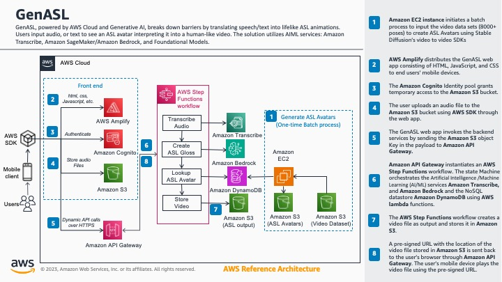

# GenASL - Generative AI powered American Sign Language Avatars

In today's world, effective communication is essential for fostering inclusivity and breaking down barriers. However, for individuals who rely on visual communication methods like American Sign Language (ASL), traditional communication tools often fall short. That's where GenASL comes in – a Generative AI-powered solution that translates speech or text into expressive ASL avatar animations, bridging the gap between spoken/written language and sign language. 

The rise of the foundational models, and the fascinating world of Generative AI that we live in, is incredibly exciting and it opens up doors to imagine and build what was not previously possible. In this blog-post, we'll dive into the architecture and implementation details of GenASL, leveraging AWS Generative AI capabilities to create human-like ASL avatar videos.


## Architecture Overview

The GenASL solution comprises several AWS services working together to enable seamless translation from speech/text to ASL avatar animations. Users send audio, video, or text as input to GenASL, and they will visualize an ASL avatar video that interprets the input data. The solution utilizes the AWS AIML services namely Amazon Transcribe, Amazon SageMaker/Amazon Bedrock, and Foundational Models. 

Here's a high-level overview of the architecture:



1. **Amazon EC2 instance** initiates a batch process to create ASL Avatars from a video data set consisting of  8000+ poses using RTMPose, a Real-Time Multi-Person Pose Estimation toolkit based on MMPose.
2. **AWS Amplify** distributes the GenASL web app consisting of HTML, JavaScript, and CSS to end users’ mobile devices.
3. The **Amazon Cognito** Identity pool grants temporary access to the Amazon S3 bucket.
4. The user uploads an audio file to the Amazon S3 bucket using AWS SDK through the web app.
5. The GenASL web app invokes the backend services by sending the **Amazon S3** object Key in the payload to an API hosted on Amazon API Gateway. 
6. **Amazon API Gateway** instantiates an AWS Step Functions workflow. The state Machine orchestrates the Artificial Intelligence /Machine Learning (AI/ML) services Amazon Transcribe, and Amazon Bedrock and the NoSQL datastore Amazon DynamoDB using AWS lambda functions. 
7. The AWS Step Functions workflow generates a pre-signed URL of the ASL Avatar video for the corresponding audio file. 
8. A pre-signed URL for the video file stored in Amazon S3 is sent back to the user’s browser through Amazon API Gateway. The user’s mobile device plays the video file using the pre-signed URL.


## Technical Deep Dive

Let's dive into the implementation details of each component:

### Batch Process

The American Sign Language Lexicon Video Dataset (ASLLVD) consists of multiple synchronized videos showing the signing from different angles of more than 3,300 ASL signs in citation form, each produced by 1-6 native ASL signers. Linguistic annotations include gloss labels, sign start and end time codes, start and end handshape labels for both hands, morphological and articulatory classifications of sign type. For compound signs, the dataset includes annotations for each morpheme. To facilitate computer vision-based sign language recognition, the dataset also includes numeric ID labels for sign variants, video sequences in uncompressed-raw format, and camera calibration sequences.

We store the input dataset in an S3 bucket (Video dataset) and using RTMPose, a real-time multi-person pose estimation model based on MMPose, a Pytorch-based pose estimation open-source toolkit, we generate the ASL avatar videos. MMPose, is a  member of the OpenMMLab Project, and contains a rich set of algorithms for 2d multi-person human pose estimation, 2d hand pose estimation, 2d face landmark detection, and 133 keypoint whole-body human pose estimation 

Amazon SageMaker notebooks initiates the batch process which stores the ASL Avatar videos in another S3 bucket (ASL Avatars) for every ASL gloss and stores the ASL Gloss and it’s corresponding ASL avatar video’s S3 key in the DynamoDB table. 

#### Back End

The back end process has 3 steps, processing the input audio to an english text, translating the english text to ASL gloss and lastly, generating ASL avatar video from the ASL gloss. This API layer is fronted by Amazon API Gateway. API Gateway allows the user to authenticate, monitor and throttle the API request. So, whenever the API gets a request to generate the sign video, it invokes an AWS step function workflow and then return the step function execution URL back to the front-end application. The step function has three steps, outlined below. 

Input Processing: First, we convert the audio input to english text using Amazon Transcribe, an automatic speech-to-text AI service that uses deep learning for speech recognition. Amazon Transcribe is a fully managed and continuously training service, designed to handle a wide range of speech/acoustic characteristics, including variations in volume, pitch, and speaking rate. 

Translation: In this step, we translate the english text to ASL Gloss using Amazon Bedrock, which is the easiest way to build and scale generative AI applications utilizing FMs. Amazon Bedrock is a fully managed service that makes Foundational Models from leading AI startups and Amazon to be available from an API, so you can choose from some of the most cutting-edge FMs available today that is best suited for your use case. It provides an API driven serverless experience for builders, providing an ability to accelerate development. We have used Anthropic’s Claude V3 to create ASL Gloss. 

Avatar Generation: In this last step, we generate the ASL avatar video from the ASL Gloss. Using the ASL gloss created in the translation layer, we look up corresponding ASL sign from the Dynamo DB table. The “lookup ASL Avatar“ Lambda function stitches the videos together, and generate a temporary video, upload that to the S3 bucket, create a pre-signed URL, and send the pre-signed URL for both sign video and avatar video back to the front-end. The front-end plays the video in a loop. 

#### Front End

The front end application is built using AWS Amplify, a framework that allows you to build, develop, and deploy full stack applications including mobile and web applications. So, you can simply add the authentication to a front-end AWS Amplify app using Amplify CLI Add Auth that generates the signup screen, login screen, as well as the backend and the Amazon Cognito Identity pools. During the audio file upload to S3, the front-end connects with S3 using the temporary identity is provided by the Cognito identity pool. 

## Security

See [CONTRIBUTING](CONTRIBUTING.md#security-issue-notifications) for more information.

## License

This library is licensed under the MIT-0 License. See the LICENSE file.


## Getting Started

This section provides steps to deploy an ASL avatar generator using AWS services. The following sections outline the steps for cloning the repository, processing data, deploying the backend, and setting up the frontend.

### 1. Clone the Git Repository

Clone the git repository using the following command:

```sh
git clone https://github.com/aws-samples/genai-asl-avatar-generator.git
```

### 2. Batch Process
Follow the instructions specified in the dataprep folder to intialize the database, 

#### 2.1 Modify Configuration File

Modify `genai-asl-avatar-generator/dataprep/config.ini` with information specific to your environment:

```ini
[DEFAULT]
s3_bucket= <your S3 bucket>
s3_prefix= <files will be generated in this prefix within your S3 bucket>
table_name=<dynamodb table name>
region=<your preferred AWS region> 
```

#### 2.2 Set Up Your Environment

Set up your environment by installing the required Python packages:

```sh
cd genai-asl-avatar-generator/dataprep
./env_setup.cmd
```

#### 2.3 Prepare Sign Video Annotation File

Prepare the sign video annotation file for each processing run:

```sh
python prep_metadata.py
```

#### 2.4 Download and Segment Sign Videos

Download sign videos, segment them, and store them in S3:

```sh
python create_sign_videos.py
```

#### 2.5 Generate Avatar Videos

Generate avatar videos:

```sh
python create_pose_videos.py
```

### 3. Deploy the Backend

Deploy the backend:

```sh
cd genai-asl-avatar-generator/backend
sam deploy --guided
```

### 4. Set Up the Frontend

#### 4.1 Initialize Amplify Environment

Initialize your Amplify environment:

```sh
amplify init
```

#### 4.2 Modify Frontend Configuration

Modify the frontend configuration to point to the backend API:

- Open `frontend/amplify/backend/function/Audio2Sign/index.py`
- Modify the `stateMachineArn` variable to have the state machine ARN shown in the output generated from backend deployment


#### 4.3 Add hosting to the amplify project
```sh
amplify add hosting
```
In the prompt, select "Amazon CloudFront and S3" and select the bucket to host GenASL application

#### 4.4 Install the relevant packages by running the following command
```sh
npm install --force
```
#### 4.5 Deploy the amplify project
```sh
amplify publish
```


## Running the solution

After deploying the Amplify project using the amplify publish command, a CloudFront URL will be returned. You can use this URL to access the GenASL demo application.

With the application open, you can register a new user and test the ASL avatar generation functionality.

## Cleanup

### 1. Delete the Frontend Amplify Application

Remove all the frontend resources created by Amplify using the following delete command:

```sh
amplify delete
```

### 2. Delete the Backend Resources

Remove all the backend resources created by SAM using the following delete command:

```sh
sam delete
```

### 3. Cleanup Resources Used by Batch Process

- If you created a new EC2 instance for running the batch process, you can terminate the EC2 instance using the AWS Console.
- If you reused an existing EC2 instance, you can delete the project folder recursively to clean up all the resources:

```sh
rm -rf genai-asl-avatar-generator
```

### 4. Delete the S3 Bucket

Use the following AWS CLI commands to delete the buckets created for storing ASL videos:
Replace <bucket-name> with the name of your S3 bucket. 
```sh
aws s3 rm s3://<bucket-name> --recursive
aws s3 rb s3://<bucket-name> --force  
```


## Conclusion

By following these steps, you should be able to deploy the GenAI ASL Avatar Generator to your AWS environment. Make sure to adjust the configurations according to your specific requirements and environment settings. If you encounter any issues, refer to the project documentation or seek help from the community.
 
